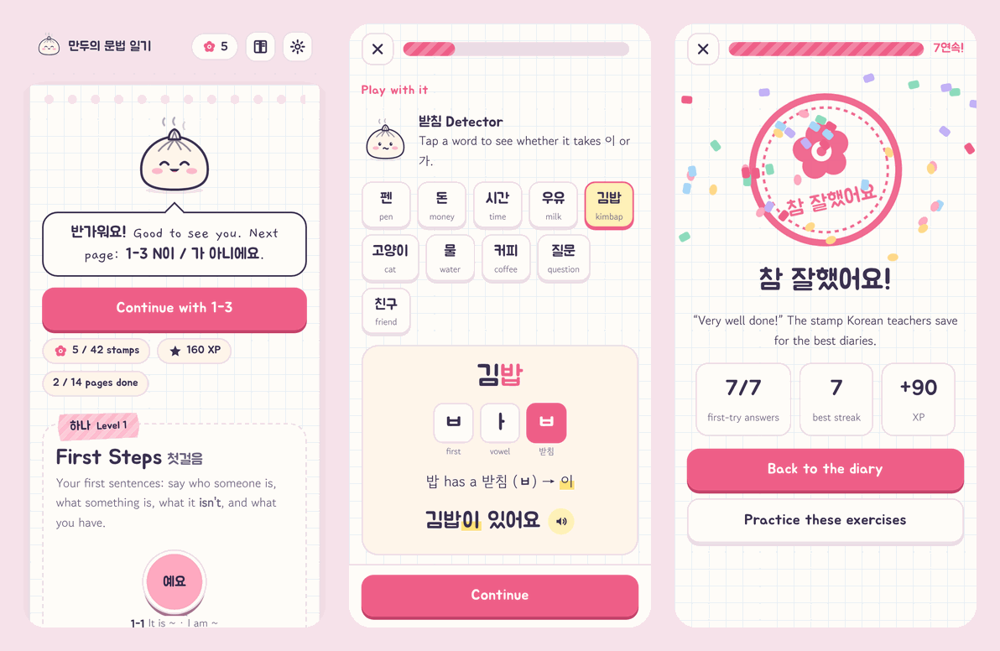

# 만두의 문법 일기 · Mandu's Grammar Diary

A cute, interactive game for learning Korean grammar, one pattern at a time and in the order learners need them.
Mandu the steamed bun walks you through each pattern with short stories, "guess the rule" puzzles,
hands-on labs and lots of small exercises. Finish a lesson and you earn a **참 잘했어요** stamp,
the stamp Korean teachers press into kids' diaries.

This is a **prototype**: three playable levels (11 lessons + 3 pop quizzes) and a roadmap for what comes next.



## Play it

No install and no build step. Open `index.html` in any modern browser (double-clicking it works).

Other options:

- **One-file version:** `npm run build` writes `dist/mandu-grammar-diary.html`, a single file you can send to a friend.
- **On the web:** turn on GitHub Pages for this repo (Settings → Pages → deploy from the `main` branch, root folder).

Progress is saved in your browser (localStorage). It never leaves your device.

## What's inside

| Level | Theme | Lessons |
| --- | --- | --- |
| 하나 · First Steps | Noun sentences | 1-1 이에요/예요 · 1-2 은/는 · 1-3 이/가 아니에요 · 1-4 이/가 있어요/없어요 · pop quiz |
| 둘 · On the Move | Verb sentences | 2-1 -아요/어요/해요 · 2-2 을/를 · 2-3 에 vs 에서 · 2-4 안 / -지 않아요 · pop quiz |
| 셋 · Time Travel | Tenses and wishes | 3-1 -았/었어요 · 3-2 -(으)ㄹ 거예요 · 3-3 -고 싶어요 · pop quiz |
| 넷 to 아홉 | On the roadmap | particles (도, 의, 하고, (으)로, 에게…), linking (-고, -지만, -아서), can/please, plans, describing, irregular verbs |

### How a lesson plays

1. **Story time.** A short chat between Minji (a bunny), Junho (a bear) and Nabi the cat, with the new grammar highlighted. Tap the speaker button to hear any line.
2. **Guess the rule.** Look at examples and guess the pattern before it's explained. It doesn't count against you.
3. **Learn.** The rule in detail: forms, 받침 rules, contractions, nuance, common mistakes, cultural notes and optional "deep dives".
4. **Play with it.** Toys with no wrong answers: the **받침 Detector** splits a syllable into its letters and picks the right particle; **Mandu's Verb Steamer** conjugates any verb step by step.
5. **Exercises.** Fill the blank, build the sentence from tiles, sort words into baskets, match pairs, spot the mistake, and step-by-step conjugation. Every answer explains *why*. Missed exercises come back once at the end.
6. **Notebook page.** A cheat sheet for the lesson is saved to your **grammar notebook**.
7. **Stamp.** 참 잘했어요 (3), 잘했어요 (2) or 힘내요 (1), based on first-try answers.

Each level ends with a **쪽지 시험** (pop quiz) that mixes everything from the level. You get 3 hearts.

### Other things worth knowing

- **Grammar notebook** (book icon): every finished lesson's cheat sheet, plus Mandu's tools for checking any word or verb.
- **Settings** (gear icon): sound effects, Korean voice, English translations in stories, light/dark theme, *Unlock everything* (skip ahead if you already know the basics) and reset.
- **Korean voice** uses your device's text-to-speech. Most phones and Chrome/Edge/Safari have a Korean voice; if yours doesn't, the speaker buttons stay quiet.
- **Keyboard:** number keys pick answers, Enter continues, Esc leaves a lesson.

## Project layout

```
index.html            the page; lists every script in load order
css/style.css         all styles (theme tokens, light and dark)
js/hangul.js          Hangul engine: 받침 checks, particles, conjugation with explained steps
js/art.js             inline SVG art: Mandu, the cast, stamps, icons
js/ui.js              DOM helper and the content markup ({highlight}, **bold**, __ blanks)
js/store.js           progress + settings (localStorage, safe when storage is blocked)
js/audio.js           Korean text-to-speech and tiny synthesized sound effects
js/content/course.js  course registry, roadmap and notebook tool word lists
js/content/levelN.js  the lessons, one file per level
js/labs.js            the 받침 Detector and Verb Steamer
js/cards.js           one renderer per card type
js/player.js          the lesson/quiz player: progress, feedback, retries, hearts, stamps
js/app.js             map, lesson previews, notebook, settings
tests/                Node tests for the engine and for every lesson file
tools/build.mjs       bundles everything into one HTML file
```

Plain HTML, CSS and JavaScript with no dependencies. The scripts are classic (not ES modules) so the game runs straight from `file://`.

## Adding content

Lessons are data, so adding one never touches the game code.

### Add a lesson

Open the level file (for example `js/content/level2.js`) and add an object to its `lessons` array:

```js
{
  id: "2-5",                    // level-number, position
  sticker: "도",                 // short label for the map node (6 characters max)
  pattern: "N도",                // the pattern as it appears in titles
  title: "Also, too",
  goal: "One sentence on what the learner will be able to do.",
  cards: [ /* see card types below; at least 3 exercises */ ],
  notes: {                       // the notebook cheat sheet
    meaning: "also / too",
    forms: [["after any noun", "N{도}", "저도"]],          // [when, form, example]
    examples: [["저도 학생이에요.", "I'm a student too."]],
    tips: ["Replaces 은/는, 이/가 and 을/를."],
  },
},
```

### Add a level

Create `js/content/level4.js` that calls `KG.addLevel({ id: 4, num: "넷", ko: "…", title: "…", blurb: "…", lessons: [...], quiz: { count: 10, extra: [...] } })`,
add `<script src="js/content/level4.js"></script>` to `index.html` after the other level files, and remove that level from `roadmap` in `course.js`.

### Card types

Info cards (not graded):

| type | fields |
| --- | --- |
| `scene` | `place`, `lines: [[speaker, korean, english], …]`, `note`. Speakers: `minji`, `junho`, `nabi`, `mandu` |
| `discover` | `examples: [[korean, english]]`, `q`, `options`, `answer` (index), `explain`, optional `intro` |
| `learn` | `title`, `blocks`: `{p}`, `{formula: "Noun + {이에요}"}`, `{table: {head, rows}}`, `{ex: [[ko, en]]}`, `{tip}`, `{warn}`, `{list}`, `{roles: [[ko, label]]}`, `{reveal: {q, a}}` |
| `lab` | `lab: "batchim"` with `pair: ["은", "는"]`, `words: [[ko, en]]`, optional `template: "{np} 있어요"`; or `lab: "verbs"` with `mode` (`present`, `past`, `future`, `want`, `negative`) and `verbs: [[dictionary form, en]]` |

Exercises (graded):

| type | fields |
| --- | --- |
| `choice` | `q` and/or `sentence` with one `__` blank, `en`, `options`, `answer` (index), `explain`, optional `why: {option: reason}`, `fixed: true` to keep option order |
| `build` | `en`, `tiles` **in the correct order** (they're shuffled in play), optional `extra` distractor tiles, optional `alt` accepted answers |
| `sort` | `q`, `buckets` (2 or 3), `items: [[label, english, bucketIndex, hint?]]`, optional `auto: "batchim"` or `"vowel"` for automatic hints, `join: true` to show "word + bucket" |
| `match` | `pairs: [[left, right]]` (3 to 5) |
| `fix` | `sentence` with the mistake in `[brackets]`, `en`, `options`, `answer`, `explain` |
| `steps` | `q`, `start`, `steps: [{q, options, answer, show, hint?}]`, `explain` |

### Text markup

| write | you get |
| --- | --- |
| `{이에요}` | highlighted target grammar |
| `{는\|topic}` | highlighted, tap to see "topic" |
| `**bold**`, `*italic*` | bold, italic |
| `~~에요~~` | struck through, for wrong forms |
| `__` | a blank (in `choice` sentences and `sort` labels) |

### Check your work

```
npm test
```

The content tests catch broken answer indexes, tiles that can't build the answer, sort items in the wrong basket,
particle answers that break the 받침 rule, unclosed `{braces}` and missing notes. The engine tests check the
conjugation rules against hand-verified forms.

## Ideas for next steps

- Levels 4 to 9 from the roadmap, plus a Hangul warm-up level for complete beginners.
- Listening exercises using the voice (pick the sentence you hear).
- Typing answers with an on-screen Hangul keyboard.
- Spaced-repetition review of old mistakes and a daily streak.
- Drag-and-drop for tiles and baskets (taps work everywhere today).
